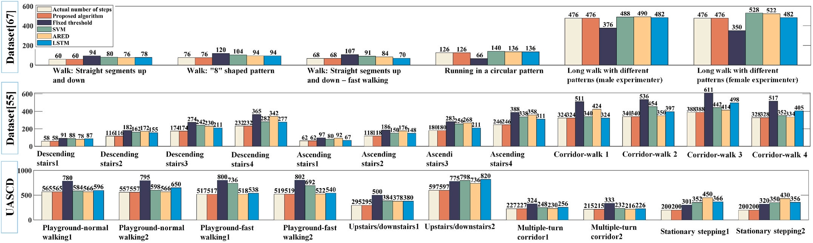
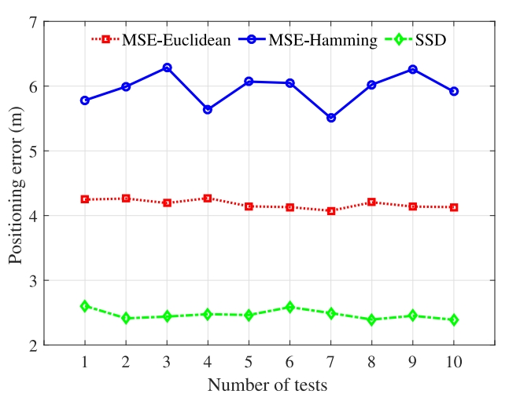
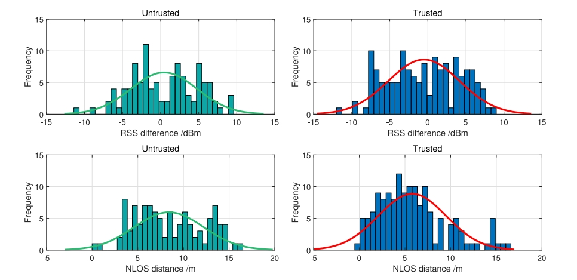
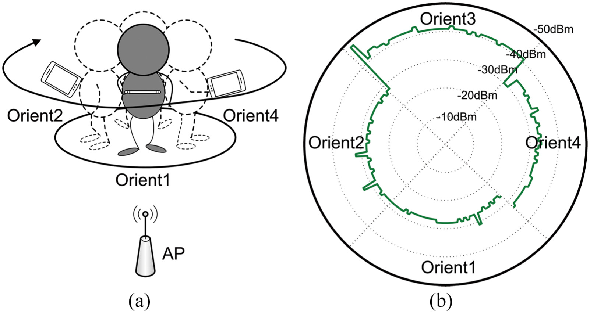

## 个人介绍 (About Me)

***

山东建筑大学项目研究员/副教授，硕士生导师，中国电子科技集团公司第五十四研究所综合时空网络与装备技术全国重点实验室（原卫星导航系统与装备技术国家重点实验室）博士后，山东省青创团队带头人，长期从事室内外无缝精密定位、活动感知、实景三维等方面的研究工作，以第一/通讯作者发表高水平论文30余篇，其中，ESI高被引1篇，中科院1区TOP5篇、2区TOP3篇，EI 6篇，中国科协科技期刊双语传播工程1篇，中国知网高被引论文5篇；出版学术著作2部；授权发明专利14项（首位6项，美国专利1项）；获得卫星导航定位科技进步二等奖2项、山东省机械工业科学技术一等奖1项、山东省人工智能科技进步二等奖1项。主持国家自然科学基金青年项目、山东省青创团队计划项目、河北省自然科学基金面上项目、山东省自然科学基金青年项目、河北省燕赵黄金台聚才计划骨干人才项目重点资助等纵向科研项目，核心参与国家重点研发计划、“863”计划等国家级项目。

##  🎓研究方向(Interests)

***
<ul style=" font-size: 16px;">
  <li>室内外无缝精密定位</li>
   <li>活动感知</li>
   <li>实景三维</li>
</ul>

## 🔬科研项目(Fundings)

<table style="width: 100%; border-collapse: collapse; font-size: 16px; border: 1px solid #333; text-align: center;">
  <thead>
    <tr>
         <th style="background-color: #4a90e2; color: white; padding: 10px; text-align: center;">序号</th>
      <th style="background-color: #4a90e2; color: white; padding: 10px; text-align: center;">项目名称</th>
      <th style="background-color: #4a90e2; color: white; padding: 10px; text-align: center;">项目来源</th>
      <th style="background-color: #4a90e2; color: white; padding: 10px; text-align: center;">级别</th>
      <th style="background-color: #4a90e2; color: white; padding: 10px; text-align: center;">主持/参与</th>
    </tr>
  </thead>
  <tbody>
    <tr>
      <td style ="width:5px;">1</td>
      <td>基于智能手机WiFi/气压计/IMU的室内三维自适应高精度定位方法</td>
      <td>科技部 国家自然科学基金青年项目</td>
      <td>国家级</td>
      <td>主持</td>
    </tr>
    <tr>
     <td style ="width:5px;">2</td>
      <td>室内混合智能定位技术</td>
      <td>科技部 国家重点研发计划</td>
      <td>国家级</td>
      <td>参与</td>
    </tr>
    <tr>
      <td style ="width:5px;">3</td>
      <td>特大城市室内外无缝定位信号体制与系统构建</td>
      <td>科技部 863计划</td>
      <td>国家级</td>
      <td>参与</td>
    </tr>
    <tr>
      <td style ="width:5px;">4</td>
      <td>融合北斗/GNSS/IMU/UWB的智能手机室内外无缝精密定位关键技术研究</td>
      <td>山东省教育厅 山东省高等学校青创团队计划</td>
      <td>省级</td>
      <td>主持</td>
    </tr>
    <tr>
      <td style ="width:5px;">5</td>
      <td>城市遮蔽空间超宽带稳健厘米级定位关键技术</td>
      <td>河北省科技厅 河北省自然科学基金面上项目</td>
      <td>省级</td>
      <td>主持</td>
    </tr>
    <tr>
      <td style ="width:5px;">6</td>
      <td>室内复杂场景WiFi与MARG智能融合的行人高可用定位关键技术研究</td>
      <td>山东省科技厅 山东省自然科学基金青年项目</td>
      <td>省级</td>
      <td>主持</td>
    </tr>
    <tr>
      <td style ="width:5px;">7</td>
      <td>基于WiFi NGP的室内稳健亚米级三维定位方法</td>
      <td>河北省人社厅 河北省燕赵黄金台聚才计划骨干人才项目（博士后平台）（重点资助）</td>
      <td>省级</td>
      <td>主持</td>
    </tr>
  </tbody>
</table>

## 📚代表论著 (Papers)

### 🚀SCI期刊论文 (5篇代表作 平均影响因子：8.58)

<table style=" font-size: 16px;">
    <tr>
    <th style="background-color: #4a90e2; color: white; padding: 10px; text-align: center;">代表图片</th>
    <th style="background-color: #4a90e2; color: white; padding: 10px; text-align: center;">论文名称</th>
    <th style="background-color: #4a90e2; color: white; padding: 10px; text-align: center;">第一/通讯作者</th>
    <th style="background-color: #4a90e2; color: white; padding: 10px; text-align: center;">期刊名称</th>
    <th style="background-color: #4a90e2; color: white; padding: 10px; text-align: center;">影响因子</th>
    <th style="background-color: #4a90e2; color: white; padding: 10px; text-align: center;">期刊分类</th>
    <th style="background-color: #4a90e2; color: white; padding: 10px; text-align: center;">发表日期</th>
  </tr>
      <tr>
    <td></td>
    <td><a href="https://www.sciencedirect.com/science/article/abs/pii/S0952197625006190">Precise  Step Counting Algorithm for Pedestrians using Ultra-low-cost Foot-mounted  Accelerometer</a></td><td>第一作者</td><td>Engineering Applications of Artificial Intelligence</td><td>IF:7.5</td><td>一区TOP</td><td>2025-04-03</td>
  </tr>
     <tr>
    <td></td>
    <td><a href="https://www.sciencedirect.com/science/article/abs/pii/S1568494624008068">Inverse Distance Weight Assisted Particle Swarm Optimized Indoor Localization for Smartphone</a></td><td>第一作者</td><td>Applied Soft Computing</td><td>IF:7.2</td><td>一区TOP</td><td>2024-08-09</td>
  </tr>
     <tr>
    <td></td>
    <td><a href="www.sciencedirect.com/science/article/pii/S0957417423033699">LOS compensation and trusted NLOS recognition assisted WiFi RTT indoor positioning algorithm</a></td><td>唯一通讯作者</td><td>Expert Systems with Applications</td><td>IF:8.5</td><td>一区TOP</td><td>2024-01-13</td>
  </tr>
      <tr>
    <td></td>
      <td ><a href="https://www.sciencedirect.com/science/article/abs/pii/S0957417423002798">PSOSVRPos: WiFi indoor positioning using SVR optimized by PSO</a>
(ESI高被引)
</td><td>第一作者</td><td>Expert Systems with Applications</td><td>IF:8.5</td><td>一区TOP</td><td>2023-04-14</td>
  </tr>
  <tr>
    <td></td>
    <td> <a href="https://link.springer.com/article/10.1186/s43020-022-00086-y">Supplementary open dataset for WiFi indoor localization based on received signal strength</a></td><td>第一作者</td><td>Satellite Navigation</td><td>IF:11.2</td><td>一区TOP</td><td>2022-11-18</td>
  </tr>
</table>

### 📖学术著作

<table style="width: 100%; border-collapse: collapse; font-size: 16px; border: 1px solid #333; text-align: center;">
  <tr>
        <th style="background-color: #4a90e2; color: white; padding: 10px; text-align: center;">序号</th>
          <th style="background-color: #4a90e2; color: white; padding: 10px; text-align: center;">作者</th>
          <th style="background-color: #4a90e2; color: white; padding: 10px; text-align: center;">著作名称</th>
          <th style="background-color: #4a90e2; color: white; padding: 10px; text-align: center;">出版社</th>
          <th style="background-color: #4a90e2; color: white; padding: 10px; text-align: center;">出版时间</th>
      		<th style="background-color: #4a90e2; color: white; padding: 10px; text-align: center;">备注</th>
  </tr>
  <tr>
          <td>1</td>
          <td><b>毕京学</b>，刘克强，汪云甲</td>
          <td>面向智能手机的室内三维位置感知与活动识别</td>
          <td>中国矿业大学出版社</td>
          <td>2021.03</td>
      		<td>全国百佳图书出版单位</td>
  </tr>
  <tr>
        <td style ="width:5px;">2</td>
          <td>齐红霞，汪云甲，秦凯，<b>毕京学</b></td>
          <td>室内楼层识别与高程估计</td>
          <td>中国矿业大学出版社</td>
          <td>2022.12</td>
      <td>全国百佳图书出版单位</td>
  </tr>
    </table>

### 🛠️EI期刊论文
***
<table style="width: 100%; border-collapse: collapse; font-size: 16px; border: 1px solid #333; text-align: center;">
  <tr>
    <th style="background-color: #4a90e2; color: white; padding: 10px; text-align: center;">序号</th>
    <th style="background-color: #4a90e2; color: white; padding: 10px; text-align: center;">论文名称</th>
    <th style="background-color: #4a90e2; color: white; padding: 10px; text-align: center;">作者</th>
    <th style="background-color: #4a90e2; color: white; padding: 10px; text-align: center;">第一/通讯作者</th>
    <th style="background-color: #4a90e2; color: white; padding: 10px; text-align: center;">期刊名称</th>
    <th style="background-color: #4a90e2; color: white; padding: 10px; text-align: center;">日期</th>
    <th style="background-color: #4a90e2; color: white; padding: 10px; text-align: center;">备注</th>
  </tr>
  <tr>
    <td style ="width:5px;">1</td>
    <td>后向窗口滤波优化的多行人多活动计步方法</td>
    <td><b>毕京学</b>, 卢文珂, 王建辉, 等</td>
    <td>第一作者</td>
    <td>中国惯性技术学报</td>
          <td  style ="width:100px;">2024-09-30</td>
    <td></td>
  </tr>
   <tr>
        <td style ="width:5px;">4</td>
    <td>面向智能手机的改进有限状态机步态探测算法</td>
    <td><b>毕京学</b>, 甄杰, 姚国标, 等</td>
    <td>第一作者</td>
    <td>武汉大学学报(信息科学版)</td>
        <td  style ="width:100px;">2023-02-09</td>
    <td>知网高被引</td>
  </tr>
  <tr>
      <td style ="width:5px;">2</td>
    <td>智能手机Wi-Fi/PDR室内混合定位优化问题研究</td>
    <td><b>毕京学</b></td>
    <td>第一作者</td>
    <td>测绘学报</td>
          <td  style ="width:100px;">2021-10-15</td>
    <td></td>
  </tr>
    <tr>
    <td style ="width:5px;">3</td>
    <td>顾及BLE信标几何优化的室内测距定位方法</td>
    <td><b>毕京学</b>, 汪云甲, 宁一鹏, 等</td>
    <td>第一作者</td>
    <td>中国矿业大学学报</td>
          <td  style ="width:100px;">2021-03-15</td>
    <td>知网高被引，入选中国科协“科技期刊双语传播工程”</td>
  </tr>
    <tr>
    <td style ="width:5px;">5</td>
    <td style ="width:250px;">基于随机森林回归的智能手机用步长估计模型</td>
    <td style ="width:80px;"><b>毕京学</b>, 汪云甲, 齐红霞, 等</td>
    <td style ="width:80px;">第一作者</td>
    <td style ="width:120px;">中国惯性技术学报</td>
    <td  style ="width:100px;">2020-04-15</td>
    <td></td>
  </tr>
</table>

### 📖中文核心论文

<table style="width: 100%; border-collapse: collapse; font-size: 16px; border: 1px solid #333; text-align: center;">
  <tr>
    <th style="background-color: #4a90e2; color: white; padding: 10px; text-align: center;">序号</th>
    <th style="background-color: #4a90e2; color: white; padding: 10px; text-align: center;">论文名称</th>
    <th style="background-color: #4a90e2; color: white; padding: 10px; text-align: center;">作者</th>
    <th style="background-color: #4a90e2; color: white; padding: 10px; text-align: center;">第一/通讯作者</th>
    <th style="background-color: #4a90e2; color: white; padding: 10px; text-align: center;">期刊名称</th>
       <th style="background-color: #4a90e2; color: white; padding: 10px; text-align: center;">日期</th>
    <th style="background-color: #4a90e2; color: white; padding: 10px; text-align: center;">备注</th>
  </tr>
  <tr>
    <td style ="width:5px;">1</td>
    <td style ="width:250px;">室内典型场景下UWB基站共面部署研究</td>
    <td style ="width:80px;"><b>毕京学</b>, 李世卿, 刘家良, 等</td>
    <td style ="width:80px;">第一作者</td>
    <td style ="width:120px;">测绘科学</td>
    <td  style ="width:100px;">2024-03-20</td>
    <td></td>
  </tr>
  <tr>
       <td style ="width:5px;">2</td>
    <td>顾及设备高度差的超宽带测距定位精度分析</td>
    <td><b>毕京学</b>, 李世卿, 张新宇, 等</td>
    <td>第一作者</td>
    <td>测绘科学</td>
          <td  style ="width:100px;">2023-10-20</td>
    <td></td>
  </tr>
  <tr>
          <td style ="width:5px;">3</td>
    <td>RSS最小值动态补偿的室内WKNN指纹定位方法</td>
    <td><b>毕京学</b>, 汪云甲, 纪冬华, 等</td>
    <td>第一作者</td>
    <td>测绘科学</td>
          <td  style ="width:100px;">2020-10-30</td>
    <td></td>
  </tr>
  <tr>
          <td style ="width:5px;">4</td>
    <td>全向指纹和Wi-Fi感知概率的WKNN定位方法</td>
    <td><b>毕京学</b>, 汪云甲, 曹鸿基, 等</td>
    <td>第一作者</td>
    <td>测绘科学</td>
          <td  style ="width:100px;">2018-06-27</td>
    <td></td>
  </tr>
  <tr>
          <td style ="width:5px;">5</td>
    <td>一种基于全向指纹库的WiFi室内定位方法</td>
    <td><b>毕京学</b>, 汪云甲, 曹鸿基, 等</td>
    <td>第一作者</td>
    <td>测绘通报</td>
          <td  style ="width:100px;">2018-02-25</td>
    <td>知网高被引</td>
  </tr>
  <tr>
          <td style ="width:5px;">6</td>
    <td>高斯函数定权的改进KNN室内定位方法</td>
    <td><b>毕京学</b>, 甄杰, 汪云甲, 等</td>
    <td>第一作者</td>
    <td>测绘通报</td>
          <td  style ="width:100px;">2017-06-25</td>
    <td>知网高被引</td>
  </tr>
  <tr>
          <td style ="width:5px;">7</td>
    <td>一种基于手机端的室内外场景识别方法及其初步实验</td>
    <td><b>毕京学</b>, 汪云甲, 甄杰</td>
    <td>第一作者</td>
    <td>地理与地理信息科学</td>
          <td  style ="width:100px;">2017-05-15</td>
    <td></td>
  </tr>
  <tr>
          <td style ="width:5px;">8</td>
    <td>Android手机GPS和A-GPS定位精度分析</td>
    <td><b>毕京学</b>, 甄杰, 郭英</td>
    <td>第一作者</td>
    <td>测绘通报</td>
          <td  style ="width:100px;">2016-07-25</td>
    <td>知网高被引</td>
  </tr>
  <tr>
          <td style ="width:5px;">9</td>
    <td>基于CORS的高精度实时坐标转换方法探究</td>
    <td><b>毕京学</b>, 郭英, 张鼎凯, 等</td>
    <td>第一作者</td>
    <td>测绘科学</td>
    <td  style ="width:100px;">2014-12-20</td>
    <td></td>
  </tr>
</table>

## 💻发明专利

<table style="width: 100%; border-collapse: collapse; font-size: 16px; border: 1px solid #333; text-align: center;">
  <tr>
        <th style="background-color: #4a90e2; color: white; padding: 10px; text-align: center;">序号</th>
          <th style="background-color: #4a90e2; color: white; padding: 10px; text-align: center;">专利名称</th>
          <th style="background-color: #4a90e2; color: white; padding: 10px; text-align: center;">申请人</th>
          <th style="background-color: #4a90e2; color: white; padding: 10px; text-align: center;">发明人</th>
          <th style="background-color: #4a90e2; color: white; padding: 10px; text-align: center;">专利号</th>
      		<th style="background-color: #4a90e2; color: white; padding: 10px; text-align: center;">授权公告日</th>
  </tr>
      <tr>
          <td>1</td>
          <td>一种基于低成本加速度计的自适应精准计步方法</td>
          <td>山东建筑大学</td>
          <td><b>毕京学</b>; 王建辉; 曹鸿基等</td>
          <td>ZL202411232135.0</td>
      		<td>2025.01.21</td>
  </tr>
          <tr>
          <td>2</td>
          <td> 一种基于三维激光扫描的箱梁精准快速拼接方法</td>
          <td>山东建筑大学</td>
          <td><b>毕京学</b>; 卢文珂; 高磊等</td>
          <td>ZL202411139197.7</td>
      		<td>2024.08.20</td>
  </tr>
          <tr>
          <td>3</td>
          <td>一种端云协同的室内电磁指纹更新方法和系统</td>
          <td>山东建筑大学</td>
          <td><b>毕京学</b>; 程娜; 姚国标等</td>
          <td>ZL202310624318.6</td>
      		<td>2024.03.12</td>
  </tr>
  <tr>
        <td style ="width:5px;">4</td>
          <td>一种狭长空间中的定位方法</td>
           <td>山东建筑大学</td>
          <td><b>毕京学</b>; 姚国标; 曹鸿基等</td>
          <td>ZL202211282950.9</td>
          <td>2023.04.07</td>
        </tr>
      <tr>
          <td>5</td>
          <td>一种步态探测算法、装置以及系统</td>
          <td>山东建筑大学</td>
          <td><b>毕京学</b>; 姚国标; 宁一鹏等</td>
          <td>ZL202010231228.7</td>
      		<td>2022.08.23</td>
  </tr>
    </table>

##  🏆教学科研奖励 (Honors)

### 🔬科研奖励

<ul style="font-size: 16px;">
    <li>
<b>2024年</b> 获得2023年度中国卫星导航定位协会“卫星导航定位科技进步奖”二等奖，项目为《室内外复杂场景高精度无缝定位关键技术及应用》，排名第3。
    </li>
    <li>
       <b>2020年</b> 获得2019年度中国卫星导航定位协会“卫星导航定位科技进步奖”二等奖，项目为《煤矿区多源增强GNSS无缝定位关键技术及其应用》，排名第5。
    </li>
    <li>
        <b>2023年</b> 获得2022年度山东省自然资源厅“山东省自然资源科学技术奖”一等奖，项目为《宽基线倾斜影像智能匹配及实景三维重建应用》，排名第7。
    </li>
    <li>
    <b>2024年</b> 获得2023年度山东省机械工业科学技术协会“山东省机械工业科学技术奖”一等奖，项目为《多模态智能终端行人航位推算关键技术》，排名第2。
    </li>
    <li>
    <b>2024年</b> 获得2023年度山东省机械工业科学技术协会“山东省机械工业科学技术奖”二等奖，项目为《基于无线信号的室内精密定位优化研究》，排名第1。
    </li>
</ul>

### 👨‍🏫教学奖励

<ul style="font-size: 16px;">
    <li>
        <b>2020年</b> 获得2019年度山东建筑大学“优秀指导教师奖”一等奖，排名1/1。
    </li>
    <li>
        <b>2021年</b> 获得2020年度山东建筑大学“优秀指导教师奖”二等奖，排名1/1。
    </li>
    <li>
        <b>2022年</b> 获得2022年全国大学生测绘学科创新创业智能大赛“优秀指导教师奖”（测绘程序设计比赛专业组），排名1/1。
    </li>
    <li>
        <b>2023年</b> 获得2022年度山东建筑大学“优秀指导教师奖”一等奖，排名1/1。
    </li>
    <li>
        <b>2023年</b> 获得2023年度山东建筑大学“优秀班主任”荣誉称号，排名1/1。
    </li>
    <li>
        <b>2024年</b> 获得2023年度山东建筑大学“优秀指导教师奖”一等奖，排名1/1。
    </li>
</ul>

### 🏆指导学生奖励

<table style="width: 100%; border-collapse: collapse; font-size: 16px; border: 1px solid #333; text-align: center;">
  <tr>
        <th style="background-color: #4a90e2; color: white; padding: 10px; text-align: center;">序号</th>
          <th style="background-color: #4a90e2; color: white; padding: 10px; text-align: center;">荣誉名称</th>
          <th style="background-color: #4a90e2; color: white; padding: 10px; text-align: center;">获奖人员</th>
          <th style="background-color: #4a90e2; color: white; padding: 10px; text-align: center;">奖励级别</th>
          <th style="background-color: #4a90e2; color: white; padding: 10px; text-align: center;">获奖时间</th>
      <th style="background-color: #4a90e2; color: white; padding: 10px; text-align: center;">颁发单位</th>
      		<th style="background-color: #4a90e2; color: white; padding: 10px; text-align: center;">备注</th>
  </tr>
      <tr>
          <td>1</td>
          <td>2024年度山东省研究生创新成果</td>
          <td>李世卿、王建辉、赵美琦</td>
          <td>省级</td>
          <td>2025.02.08</td>
      		<td>山东省教育厅</td>
      		<td>获奖成果名称：无线信号定位定向关键技术</td>
  </tr>
          <tr>
          <td>2</td>
          <td> 2024届山东省普通高等学校优秀班干部</td>
          <td>马秀振</td>
          <td>省级</td>
          <td></td>
      		<td>山东省人力资源和社会保障厅</td>
            <td></td>
  </tr>
          <tr>
          <td>3</td>
          <td>2024届山东省普通高等学校优秀毕业生</td>
          <td>辛会广</td>
          <td>省级</td>
          <td></td>
      		<td>山东省人力资源和社会保障厅</td>
            <td></td>
  </tr>
  <tr>
        <td style ="width:5px;">4</td>
          <td>2024届优秀学士学位论文（设计）</td>
           <td>辛会广</td>
          <td>校级</td>
          <td>2023.07.03</td>
          <td>山东建筑大学</td>
      <td>获奖成果名称：基于支持向量回归与温度补偿气压的室内高度估计方法</td>
        </tr>
      <tr>
          <td>5</td>
          <td>2023届优秀学士学位论文（设计）</td>
          <td>王腾</td>
          <td>校级</td>
          <td>2023.07.10</td>
      		<td>山东建筑大学</td>
          <td>获奖成果名称：基于信道状态信息的人体行为识别研究</td>
  </tr>
          <tr>
          <td>6</td>
          <td>2023届山东省普通高等学校优秀毕业生</td>
          <td>曹景春</td>
          <td>省级</td>
          <td>2023.04.17</td>
          <td>山东省人力资源和社会保障厅</td>
              <td></td>
  </tr>
          <tr>
          <td>7</td>
          <td>2023届山东省普通高等学校优秀毕业生</td>
          <td>李永辉</td>
          <td>省级</td>
          <td>2023.04.17</td>
          <td>山东省人力资源和社会保障厅</td>
              <td></td>
  </tr>
          <tr>
          <td>8</td>
          <td>2023届山东省普通高等学校优秀毕业生</td>
          <td>王腾</td>
          <td>省级</td>
          <td>2023.04.17</td>
          <td>山东省人力资源和社会保障厅</td>
              <td></td>
  </tr>
          <tr>
          <td>9</td>
          <td>2022届山东省普通高等学校优秀毕业生</td>
          <td>于谋哲</td>
          <td>省级</td>
          <td>2022.04.21</td>
          <td>山东省人力资源和社会保障厅</td>
              <td></td>
  </tr>
              <tr>
          <td>10</td>
          <td>2022届山东省普通高等学校优秀毕业生</td>
          <td>谷新茹</td>
          <td>校级</td>
          <td>2022.03.31</td>
          <td>山东建筑大学</td>
              <td></td>
  </tr>
                  <tr>
          <td>11</td>
          <td>2021年度山东省高等学校优秀学生</td>
          <td>李永辉</td>
          <td>省级</td>
          <td>2022.05.01</td>
          <td>山东省教育厅</td>
              <td></td>
  </tr>
                      <tr>
          <td>11</td>
          <td>2021年度山东省高等学校优秀学生</td>
          <td>李永辉</td>
          <td>省级</td>
          <td>2022.05.01</td>
          <td>山东省教育厅</td>
              <td></td>
  </tr>
                 <tr>
          <td>12</td>
          <td>2020届优秀学士学位论文（设计）</td>
          <td>王兆乾</td>
          <td>校级</td>
          <td>2020.07.06</td>
          <td>山东建筑大学</td>
              <td>获奖成果：基于贝叶斯估计的室内WiFi指纹定位方法研究</td>
  </tr>
                 <tr>
          <td>13</td>
          <td>2020年度山东建筑大学优秀学生</td>
          <td>王兆乾</td>
          <td>校级</td>
          <td>2020.03.04</td>
          <td>山东建筑大学</td>
              <td></td>
  </tr>
    </table>

## 🧑‍🎓硕士研究生

<table style="width: 100%; border-collapse: collapse; font-size: 16px; border: 1px solid #333; text-align: center;">
  <tr>
        <th style="background-color: #4a90e2; color: white; padding: 10px; text-align: center;">序号</th>
          <th style="background-color: #4a90e2; color: white; padding: 10px; text-align: center;">年纪</th>
          <th style="background-color: #4a90e2; color: white; padding: 10px; text-align: center;">姓名</th>
          <th style="background-color: #4a90e2; color: white; padding: 10px; text-align: center;">学科类型</th>
          <th style="background-color: #4a90e2; color: white; padding: 10px; text-align: center;">研究方向</th>
      		<th style="background-color: #4a90e2; color: white; padding: 10px; text-align: center;">备注</th>
  </tr>
  <tr>
          <td>1</td>
          <td>2021级</td>
          <td>赵美琪</td>
          <td>测绘科学与技术</td>
          <td>室内外无缝精密定位</td>
      		<td>毕业</td>
  </tr>
  <tr>
        <td style ="width:5px;">2</td>
          <td>2022级</td>
          <td>李世卿</td>
          <td>土木工程</td>
          <td>室内外无缝精密定位</td>
      <td>毕业</td>
  </tr>
  <tr>
        <td style ="width:5px;">3</td>
          <td>2022级</td>
          <td>王建辉</td>
      <td>测绘科学与技术</td>
          <td>活动感知</td>
      <td>毕业</td>
     </tr>
      <tr>
          <td>4</td>
          <td>2023级</td>
          <td >卢文珂</td>
          <td>测绘工程</td>
          <td >实景三维</td>
           <td >在读</td>
  </tr>
  <tr>
        <td style ="width:5px;">5</td>
          <td>2023级</td>
          <td>文泽涛</td>
     	 <td>测绘工程</td>
          <td>活动感知</td>
      <td >在读</td>
  </tr>
  <tr>
        <td style ="width:5px;">6</td>
          <td>2024级</td>
          <td>武祥汇</td>
      <td>测绘工程</td>
          <td>室内外无缝精密定位</td>
      	<td >在读</td>
    </tr>
      <tr>
        <td style ="width:5px;">7</td>
          <td>2024级</td>
          <td>董庆涛</td>
          <td>测绘工程</td>
          <td>实景三维</td>
			<td >在读</td>
    </tr>
          <tr>
        <td style ="width:5px;">8</td>
          <td>2024级</td>
          <td>张国梁</td>
          <td>测绘工程</td>
          <td>室内外无缝精密定位</td>
              <td >在读</td>
		  
    </tr>
</table>

