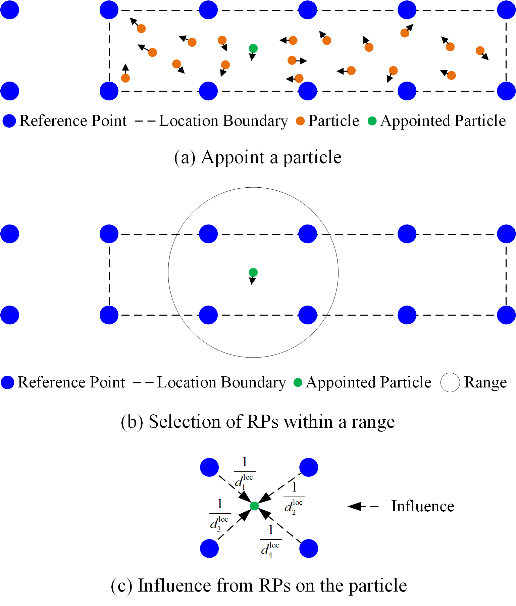

### 个人介绍 (About Me)

***

毕京学，山东建筑大学项目研究员/副教授，山东省青创团队带头人，长期从事室内外无缝精密定位、活动感知、实景三维等方面的研究工作，以第一/通讯作者发表高水平论文30余篇，其中，ESI高被引1篇，中科院1区TOP 5篇、2区TOP 3篇，EI 6篇，中国科协科技期刊双语传播工程1篇,中国知网高被引论文5篇；出版学术著作2部；授权发明专利14项（首位6项，美国专利1项）；获得卫星导航定位科技进步二等奖2项、山东省机械工业科学技术一等奖1项、山东省人工智能科技进步二等奖1项。主持国家自然科学基金青年项目、山东省青创团队计划项目、河北省自然科学基金面上项目、山东省自然科学基金青年项目、河北省燕赵黄金台聚才计划骨干人才项目重点资助等纵向科研项目，核心参与国家重点研发计划、“863”计划等国家级项目。

### 研究方向(Interests)

***

* 室内外无缝精密定位
* 活动感知
* 实景三维

### 科研项目(Fundings)

| 项目名称                                                     | 项目来源                                                     | 级别   | 主持/参与 |
| ------------------------------------------------------------ | ------------------------------------------------------------ | ------ | --------- |
| 基于智能手机WiFi/气压计/IMU的室内三维自适应高精度定位方法    | 科技部  国家自然科学基金青年项目                             | 国家级 | 主持      |
| 室内混合智能定位技术                                         | 科技部  国家重点研发计划                                     | 国家级 | 参与      |
| 特大城市室内外无缝定位信号体制与系统构建                     | 科技部 863计划                                               | 国家级 | 参与      |
| 融合北斗/GNSS/IMU/UWB的智能手机室内外无缝精密定位关键技术研究 | 山东省教育厅  山东省高等学校青创团队计划                     | 省级   | 主持      |
| 城市遮蔽空间超宽带稳健厘米级定位关键技术                     | 河北省科技厅  河北省自然科学基金面上项目                     | 省级   | 主持      |
| 室内复杂场景WiFi与MARG智能融合的行人高可用定位关键技术研究   | 山东省科技厅  山东省自然科学基金青年项目                     | 省级   | 主持      |
| 基于WiFi NGP的室内稳健亚米级三维定位方法                     | 河北省人社厅  河北省燕赵黄金台聚才计划骨干人才项目（博士后平台）（重点资助） | 省级   | 主持      |

### 代表论著 (Papers)

#### SCI期刊论文 (5篇代表作 平均影响因子：8.58)

<table>
     <tr>
    <td></td>
    <td><a href="https://www.sciencedirect.com/science/article/abs/pii/S1568494624008068">Inverse Distance Weight Assisted Particle Swarm Optimized Indoor Localization for Smartphone</a></td><td>第一作者</td><td>IF:7.2</td><td>一区TOP</td><td>2024-08-09</td>
  </tr>
     <tr>
    <td></td>
    <td><a href="www.sciencedirect.com/science/article/pii/S0957417423033699">LOS compensation and trusted NLOS recognition assisted WiFi RTT indoor positioning algorithm</a></td><td>唯一通讯作者</td><td>IF:8.5</td><td>一区TOP</td><td>2024-01-13</td>
  </tr>
  <tr>
    <td></td>
      <td ><a href="https://www.sciencedirect.com/science/article/abs/pii/S0957417423002798">PSOSVRPos: WiFi indoor positioning using SVR optimized by PSO</a></td><td>第一作者</td><td>IF:8.5</td><td>一区TOP</td><td>2023-04-14</td>
  </tr>
    <tr>
    <td></td>
    <td><a href="https://www.sciencedirect.com/science/article/abs/pii/S0952197625006190">Precise  Step Counting Algorithm for Pedestrians using Ultra-low-cost Foot-mounted  Accelerometer</a></td><td>第一作者</td><td>IF:7.5</td><td>一区</td><td>2023-04-14</td>
  </tr>
  <tr>
    <td></td>
    <td> <a href="https://link.springer.com/article/10.1186/s43020-022-00086-y">Supplementary open dataset for WiFi indoor localization based on received signal strength</a></td><td>第一作者</td><td>IF:11.2</td><td>一区</td><td>2022-11-18</td>
  </tr>
</table>

***

#### EI期刊论文

<table>
  <tr>
    <th>论文名称</th>
    <th>作者</th>
    <th>第一/通讯作者</th>
    <th>期刊名称</th>
    <th>备注</th>
  </tr>
  <tr>
    <td>基于随机森林回归的智能手机用步长估计模型</td>
    <td><b>毕京学</b>, 汪云甲, 齐红霞, 等</td>
    <td>第一作者</td>
    <td>中国惯性技术学报</td>
    <td></td>
  </tr>
  <tr>
    <td>面向智能手机的改进有限状态机步态探测算法</td>
    <td><b>毕京学</b>, 甄杰, 姚国标, 等</td>
    <td>第一作者</td>
    <td>武汉大学学报(信息科学版)</td>
    <td>知网高被引</td>
  </tr>
  <tr>
    <td>顾及BLE信标几何优化的室内测距定位方法</td>
    <td><b>毕京学</b>, 汪云甲, 宁一鹏, 等</td>
    <td>第一作者</td>
    <td>中国矿业大学学报</td>
    <td>知网高被引，入选中国科协“科技期刊双语传播工程”</td>
  </tr>
  <tr>
    <td>智能手机Wi-Fi/PDR室内混合定位优化问题研究</td>
    <td><b>毕京学</b></td>
    <td>第一作者</td>
    <td>测绘学报</td>
    <td></td>
  </tr>
  <tr>
    <td>后向窗口滤波优化的多行人多活动计步方法</td>
    <td><b>毕京学</b>, 卢文珂, 王建辉, 等</td>
    <td>第一作者</td>
    <td>中国惯性技术学报</td>
    <td></td>
  </tr>
</table>

#### 中文核心论文

<table>
  <tr>
    <th>论文名称</th>
    <th>作者</th>
    <th>第一/通讯作者</th>
    <th>期刊名称</th>
    <th>备注</th>
  </tr>
  <tr>
    <td>室内典型场景下UWB基站共面部署研究</td>
    <td><b>毕京学</b>, 李世卿, 刘家良, 等</td>
    <td>第一作者</td>
    <td>测绘科学</td>
    <td></td>
  </tr>
  <tr>
    <td>顾及设备高度差的超宽带测距定位精度分析</td>
    <td><b>毕京学</b>, 李世卿, 张新宇, 等</td>
    <td>第一作者</td>
    <td>测绘科学</td>
    <td></td>
  </tr>
  <tr>
    <td>RSS最小值动态补偿的室内WKNN指纹定位方法</td>
    <td><b>毕京学</b>, 汪云甲, 纪冬华, 等</td>
    <td>第一作者</td>
    <td>测绘科学</td>
    <td></td>
  </tr>
  <tr>
    <td>全向指纹和Wi-Fi感知概率的WKNN定位方法</td>
    <td><b>毕京学</b>, 汪云甲, 曹鸿基, 等</td>
    <td>第一作者</td>
    <td>测绘科学</td>
    <td></td>
  </tr>
  <tr>
    <td>一种基于全向指纹库的WiFi室内定位方法</td>
    <td><b>毕京学</b>, 汪云甲, 曹鸿基, 等</td>
    <td>第一作者</td>
    <td>测绘通报</td>
    <td>知网高被引</td>
  </tr>
  <tr>
    <td>高斯函数定权的改进KNN室内定位方法</td>
    <td><b>毕京学</b>, 甄杰, 汪云甲, 等</td>
    <td>第一作者</td>
    <td>测绘通报</td>
    <td>知网高被引</td>
  </tr>
  <tr>
    <td>一种基于手机端的室内外场景识别方法及其初步实验</td>
    <td><b>毕京学</b>, 汪云甲, 甄杰</td>
    <td>第一作者</td>
    <td>地理与地理信息科学</td>
    <td></td>
  </tr>
  <tr>
    <td>Android手机GPS和A-GPS定位精度分析</td>
    <td><b>毕京学</b>, 甄杰, 郭英</td>
    <td>第一作者</td>
    <td>测绘通报</td>
    <td>知网高被引</td>
  </tr>
  <tr>
    <td>基于CORS的高精度实时坐标转换方法探究</td>
    <td><b>毕京学</b>, 郭英, 张鼎凯, 等</td>
    <td>第一作者</td>
    <td>测绘科学</td>
    <td></td>
  </tr>
</table>
  

###  教学科研奖励 (Honors)

* **2024年** 获得2023年度中国卫星导航定位协会“卫星导航定位科技进步奖”二等奖，项目为《室内外复杂场景高精度无缝定位关键技术及应用》，排名第3。
* **2020年** 获得2019年度中国卫星导航定位协会“卫星导航定位科技进步奖”二等奖，项目为《煤矿区多源增强GNSS无缝定位关键技术及其应用》，排名第5。
* **2023年** 获得2022年度山东省自然资源厅“山东省自然资源科学技术奖”一等奖，项目为《宽基线倾斜影像智能匹配及实景三维重建应用》，排名第7。
* **2024年** 获得2023年度山东省机械工业科学技术协会“山东省机械工业科学技术奖”一等奖，项目为《多模态智能终端行人航位推算关键技术》，排名第2。
* **2024年** 获得2023年度山东省机械工业科学技术协会“山东省机械工业科学技术奖”二等奖，项目为《基于无线信号的室内精密定位优化研究》，排名第1。

